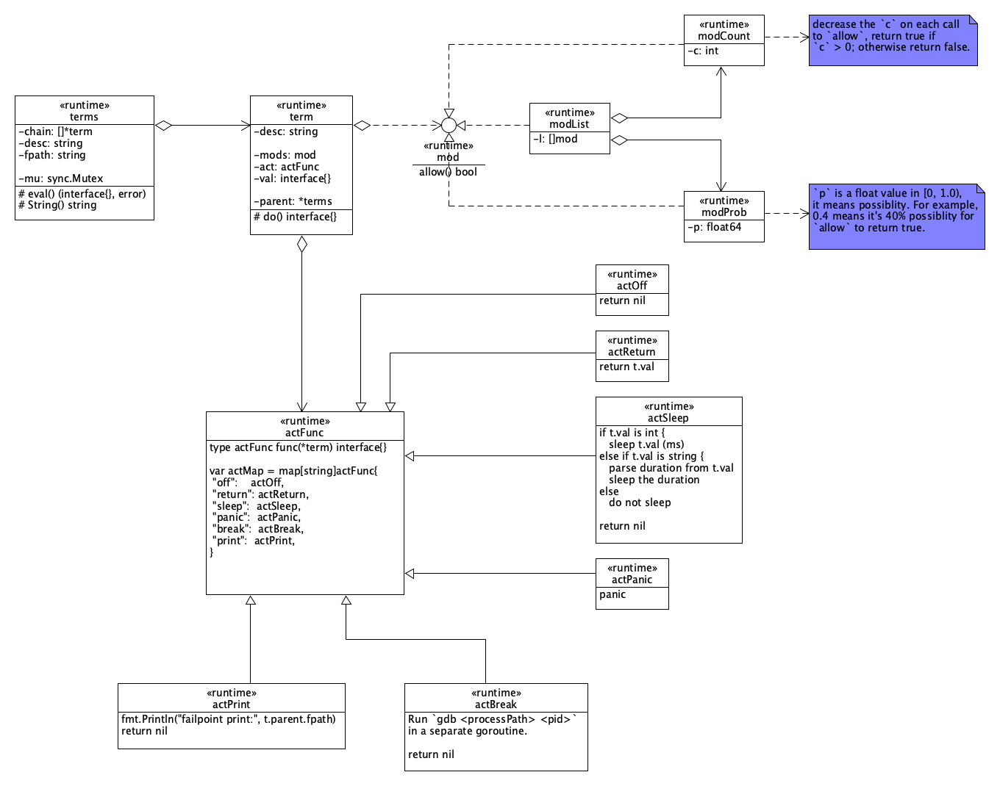

# Gofail

## Table of Contents

- **[Workflow](#workflow)**
  - [Step 1: Add failpoints](#step-1-add-failpoints)
  - [Step 2: Build your application with failpoints](#step-2-build-your-application-with-failpoints)
  - [Step 3: Trigger failpoints](#step-3-trigger-failpoints)
    - [3.1: E2E test](#31-e2e-test)
    - [3.2: Unit test](#32-unit-test)
- **[Generated code](#generated-code)**
  - [Overview](#overview)
  - [Example 1: No customized code](#example-1-no-customized-code)
  - [Example 2: With customized code](#example-2-with-customized-code)
  - [Example 3: With multiple lines of customized code](#example-3-with-multiple-lines-of-customized-code)
  - [Example 4: With gofail label](#example-4-with-gofail-label)
- **[Gofail Term](#gofail-term)**
  - [Syntax](#syntax)
  - [Design diagram](#design-diagram)

## Workflow
### Step 1: Add failpoints
Add special comments like below into your code where you want to inject failpoints,
```
// gofail: var SomeFuncString string
```

### Step 2: Build your application with failpoints
Translate the gofail comments using command below. Note that `gofail` needs to be installed beforehand using command `go install go.etcd.io/gofail@latest`.
```
$ gofail enable <optional_file_dir_list>
```

`gofail` translates all gofail comments in the provided `<optional_file_dir_list>` in place and also generates some variable 
declarations in separate files. If no `<optional_file_dir_list>` is provided, then the current directory is used. See [Generated code](#generated-code)
below to get examples on the translated & generated code.

Afterwards, add gofail runtime package into your application as a dependency module,
```
$ go get go.etcd.io/gofail/runtime
```

Finally, build your application using command `go build`.

### Step 3: Trigger failpoints
#### 3.1 E2E test
There are two ways to trigger failpoints in E2E test, which are static and dynamic ways. 

The static way is to set [gofail terms](#gofail-term) using environment variable `GOFAIL_FAILPOINTS` directly when starting your application. See example below,
```
$ GOFAIL_FAILPOINTS='SomeFuncString=sleep("600s")' ./cmd
```

You can set multiple failpoints by using ";" as the delimiter,
```
GOFAIL_FAILPOINTS='failpoint1=return("hello");failpoint2=sleep(10)' ./cmd
```

The dynamic way is to set an HTTP endpoint using environment variable `GOFAIL_HTTP` when starting your application, 
and add [gofail terms](#gofail-term) via the endpoint afterwards. See example below,
```
$ GOFAIL_HTTP="127.0.0.1:22381" ./cmd

$ curl http://127.0.0.1:22381/SomeFuncString -XPUT -d'sleep("600s")'
```

Similarly, you can set multiple failpoints using endpoint `/failpoints`,
```
curl http://127.0.0.1:22381/failpoints -X PUT -d'failpoint1=return("hello");failpoint2=sleep(10)'
```

You can get the execution count of a failpoint in the dynamic way,
```
$curl http://127.0.0.1:1234/SomeFuncString/count -XGET
```

To deactivate a failpoint,
```
$ curl http://127.0.0.1:1234/SomeFuncString -XDELETE
```

#### 3.2 Unit test
Assuming there is a function with a failpoint something like below,
```
func DoSomething() error {
    // gofail: var syscallError string
    // return errors.New(syscallError)
    if err := WhateverSyscall(); err != nil {
        return err
    }
    ......
    return nil
}
```

If the go source file doesn't import package `errors`, you can intentionally add the import item like below,
```
import (
    "errors"
    ......
)
var _ = errors.New
```

You want to add a unit test to mimic an error the `WhateverSyscall` might return, the unit test case can be something like below,
```
import (
    "testing"

    gofail "go.etcd.io/gofail/runtime"
)

func TestDoSomething(t *testing.T) {
    err := gofail.Enable("syscallError", `return("syscall somehow failed")`)
    if err != nil {
        t.Fatal(err)
    }
    defer func() {
        err = gofail.Disable("syscallError")
        if err != nil {
            t.Fatal(err)
        }
    }()

    err = DoSomething()
    if err == nil {
        t.Fatal("Expected an error, but got nil")
    }

    if !strings.Contains(err.Error(), "syscall somehow failed") {
        t.Fatalf("Unexpected error message: %v", err.Error())
    }
}
```

## Generated code
### Overview
`gofail enable <optional_file_or_dir_list>` makes the following two changes for each provided go source file, which contains the "gofail" comments, 
1. Translate the "gofail" comments in place to code that accesses the gofail runtime;
2. Generate code that constructs failpoint variables and registers them to the "gofail" runtime.

The high level format of the translated code (#1) is below,
```
<header>
customized code
<footer>
```

The customized code is optional. When there is no any customized code, the generated code only contains the header and footer. 

The format of the generated code (#2) is below. Note that there may be multiple entries, and it depends on how many "gofail" comments are in the relevant go source file. 
```
// GENERATED BY GOFAIL. DO NOT EDIT.

package <PACKAGE_NAME>

import "go.etcd.io/gofail/runtime"

var __fp_<FAILPOINT_NAME> *runtime.Failpoint = runtime.NewFailpoint("<PACKAGE_NAME>", "<FAILPOINT_NAME>")
```

The generated file name is similar to the original go source file name, but has additional suffix ".fail" in the basename. For example, the original file name is 
`example.go`, then the generated file name is `example.fail.go`.

### Example 1: No customized code
**Original code**:
```
func ExampleOneLineFunc() string {
	// gofail: var ExampleOneLine struct{}
	return "abc"
}
```

**Translated code**:
```
func ExampleOneLineFunc() string {
	if vExampleOneLine, __fpErr := __fp_ExampleOneLine.Acquire(); __fpErr == nil { _, __fpTypeOK := vExampleOneLine.(struct{}); if !__fpTypeOK { goto __badTypeExampleOneLine} ; __badTypeExampleOneLine: __fp_ExampleOneLine.BadType(vExampleOneLine, "struct{}"); };
	return "abc"
}
```

Formatting the code using `gofmt -w .`, as below:
```
func ExampleOneLineFunc() string {
	if vExampleOneLine, __fpErr := __fp_ExampleOneLine.Acquire(); __fpErr == nil {
		_, __fpTypeOK := vExampleOneLine.(struct{})
		if !__fpTypeOK {
			goto __badTypeExampleOneLine
		}
	__badTypeExampleOneLine:
		__fp_ExampleOneLine.BadType(vExampleOneLine, "struct{}")
	}
	return "abc"
}
```

**Generated code**:
```
// GENERATED BY GOFAIL. DO NOT EDIT.

package examples

import "go.etcd.io/gofail/runtime"

var __fp_ExampleOneLine *runtime.Failpoint = runtime.NewFailpoint("ExampleOneLine")
```

In the following examples, only the corresponding generated entry is provided because they have the same file header, including comment, package clause and import declaration. 

### Example 2: With customized code
**Original code**:
```
func ExampleFunc() string {
	// gofail: var ExampleString string
	// return ExampleString
	return "example"
}
```

The code `return ExampleString` is the customized code.

**Translated code**:
```
func ExampleFunc() string {
	if vExampleString, __fpErr := __fp_ExampleString.Acquire(); __fpErr == nil { ExampleString, __fpTypeOK := vExampleString.(string); if !__fpTypeOK { goto __badTypeExampleString} 
		 return ExampleString; __badTypeExampleString: __fp_ExampleString.BadType(vExampleString, "string"); };
	return "example"
}
```

Formatting the code using `gofmt -w .`, as below:
```
func ExampleFunc() string {
	if vExampleString, __fpErr := __fp_ExampleString.Acquire(); __fpErr == nil {
		ExampleString, __fpTypeOK := vExampleString.(string)
		if !__fpTypeOK {
			goto __badTypeExampleString
		}
		return ExampleString
	__badTypeExampleString:
		__fp_ExampleString.BadType(vExampleString, "string")
	}
	return "example"
}
```

**Generated code**:
```
var __fp_ExampleString *runtime.Failpoint = runtime.NewFailpoint("ExampleString")
```

### Example 3: With multiple lines of customized code
**Original code**:
```
func ExampleFunc() string {
	// gofail: var ExampleString string
	// ExampleString = "Hello, " + ExampleString
	// return ExampleString
	return "example"
}
```

There are two lines of customized code: `ExampleString = "Hello, " + ExampleString` and `return ExampleString`.

**Translated code**:
```
func ExampleFunc() string {
	if vExampleString, __fpErr := __fp_ExampleString.Acquire(); __fpErr == nil { ExampleString, __fpTypeOK := vExampleString.(string); if !__fpTypeOK { goto __badTypeExampleString} 
		 ExampleString = "Hello, " + ExampleString
		 return ExampleString; __badTypeExampleString: __fp_ExampleString.BadType(vExampleString, "string"); };
	return "example"
}
```

Formatting the code using `gofmt -w .`, as below:
```
func ExampleFunc() string {
	if vExampleString, __fpErr := __fp_ExampleString.Acquire(); __fpErr == nil {
		ExampleString, __fpTypeOK := vExampleString.(string)
		if !__fpTypeOK {
			goto __badTypeExampleString
		}
		ExampleString = "Hello, " + ExampleString
		return ExampleString
	__badTypeExampleString:
		__fp_ExampleString.BadType(vExampleString, "string")
	}
	return "example"
}
```

**Generated code**:
```
var __fp_ExampleString *runtime.Failpoint = runtime.NewFailpoint("ExampleString")
```

### Example 4: With gofail label
**Original code**:
```
func ExampleLabelsFunc() (s string) {
	i := 0
	// gofail: myLabel:
	for i < 5 {
		s = s + "i"
		i++
		for j := 0; j < 5; j++ {
			s = s + "j"
			// gofail: var ExampleLabels struct{}
			// continue myLabel
		}
	}
	return s
}
```

The `mylabel` is a gofail label, which is used by the customized code `continue myLabel`.

**Translated code**:
```
func ExampleLabelsFunc() (s string) {
	i := 0
	/* gofail-label */ myLabel:
	for i < 5 {
		s = s + "i"
		i++
		for j := 0; j < 5; j++ {
			s = s + "j"
			if vExampleLabels, __fpErr := __fp_ExampleLabels.Acquire(); __fpErr == nil { _, __fpTypeOK := vExampleLabels.(struct{}); if !__fpTypeOK { goto __badTypeExampleLabels} 
				 continue myLabel; __badTypeExampleLabels: __fp_ExampleLabels.BadType(vExampleLabels, "struct{}"); };
		}
	}
	return s
}
```

Formatting the code using `gofmt -w .`, as below:
```
func ExampleLabelsFunc() (s string) {
	i := 0
	/* gofail-label */ myLabel:
	for i < 5 {
		s = s + "i"
		i++
		for j := 0; j < 5; j++ {
			s = s + "j"
			if vExampleLabels, __fpErr := __fp_ExampleLabels.Acquire(); __fpErr == nil {
				_, __fpTypeOK := vExampleLabels.(struct{})
				if !__fpTypeOK {
					goto __badTypeExampleLabels
				}
				continue myLabel
			__badTypeExampleLabels:
				__fp_ExampleLabels.BadType(vExampleLabels, "struct{}")
			}
		}
	}
	return s
}
```

**Generated code**:
```
var __fp_ExampleLabels *runtime.Failpoint = runtime.NewFailpoint("ExampleLabels")
```

## Gofail Term
When triggering the failpoint from the command line, multiple failpoints can be configured, for example,
```sh
GOFAIL_FAILPOINTS='failpoint1=return("hello");failpoint2=sleep(10)' ./cmd
```

When triggering the failpoint from the HTTP endpoint, only one failpoint can be configured in each HTTP request, for example,
```sh
$ curl http://127.0.0.1:1234/SomeFuncString -XPUT -d'return("hello")'
```

In above examples, `return("hello")` and `sleep(10)` are examples of terms. 

### Syntax
The syntax of Terms/Term is described using EBNF (Extended Backus-Naur Form) as below. 
Note that the notation is consistent with Golang spec, so please refer to [go_spec#Notation](https://go.dev/ref/spec#Notation).
```
Syntax  = { Terms }
Terms   = Term { "->" Term } 
Term    = [ Mode ] Action [ Value ]
Mode    = float "%" | int "*"
Action  = "off" | "return" | "sleep" | "panic" | "break" | "print"
Value   = "(" [ int | double_quoted_string | bool ] ")"
```

Terms examples:
```
2*return("abc")->1*return("def")  // execute return("abc") twice, and execute return("def") only once
return(100)        // always return 100
return             // no value, return struct{}{} by default
return()           // no value, return struct{}{} by default
40.0%return(true)  // 40% possibility to return `true`
1.0%panic          // 1% possiblity to panic
sleep(10s)         // always sleep 10s
sleep(10)          // always sleep 10ms (unit: millisecond by default)
```

### Design diagram
The high level design for the Term is something like below diagram,

